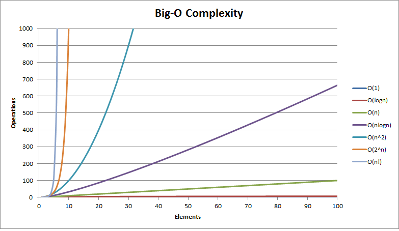

# Introduction To Algorithms & Data Structures

This lesson should give students a big picture view about why algorithms and computer science is important, as well as delve into the specifics of Big O.

## Objectives

* Students can describe how they might interact with data structures and algorithms in their future careers.
* Students know that algorithms are measured in terms of their input.
* Students can identify important complexity classes.
* Students can classify provided code or descriptions of an algorithm into the proper complexity class.

## What is Computer Science/Algorithms/Data Structures (5-10 minutes)

* Computer science is broadly, the study of computation.
  * __What kinds of things do CS degrees focus on?__
    * *efficiency*
    * *computability*
    * *problem solving*
    * *Algorithms & data structures*
    * *Operating systems, architecture, compilers, scientific computing, AI/ML, robotics...*
* Computer science is a very broad field -- but the common thread in all of these subdomains is that programs rely on data structures and algorithms to process those data structures.
  * __What are data structures? Give some examples?__
    * *systems for holding and processing data*
    * *array, hash table, stack, queue....*
    * *Does anyone want to say a JavaScript Object is a data structure?*
    * *What about a database like Postgres? This is more like a collection of structures...*
  * __What about an algorithm, define that word? Give some examples?__
    * *A process for computing something*
  * __Who implements the data structures you use most often?__
    * *language & library maintainers, mostly*
  * __Why study this stuff?__
    * *For interviews...*
    * *Because these fundamental tools are the ones that tie together all the myriad disciplines of programming*
    * *Because having strong mental models about how computers work makes you a better programmer*
    * *Eventually, you'll have to make a program you wrote faster than it is*
    * *Knowing about the available tools helps you choose the right ones*

## Big O & Complexity Theory (30 minutes)

* Complexity theory is a branch of computer science that focuses on measuring the performance of algorithms.
  * Complexity is an *abstract* measurement, not a concrete measurement...
  * __What does it mean to be an abstract measurement?__
    * *We want to be able to compare algorithms without implementing them -- planning before implementing*
    * *When comparing algorithms, we don't always want to let the code get in the way*
    * *Our measurements cannot be in concrete units, like seconds, because our algorithms might only exist on whiteboards*
* __What is Big O Notation?__
  * *An estimate of the time or space requirements of an algorithm*
  * *In terms of the input to the algorithm*
  * There are some really technical definitions that I could give of Big O, involving complex F(G(x)) math jargon but they are honestly not very helpful.
* __Why is Big O measured in terms of the input?__
  * *It allows us to measure how the algorithm scales as the input scales*
* __Why measure time and space requirements?__
  * *Those are our two limiting factors, typically*
* When we use Big O, we drop the constants and all but the "worst" factor involving 'n':
  * `3 + 5n + 2n^2` => `O(n^2)`
  * __Why do we do this?__
    * *We rarely care about small input sizes. Slow algorithms still finish quickly for small input sizes*
    * *Big O only cares about what happens as n gets VERY large*
    * *Because this is a measure of how an algorithm scales, not a measurement of specific performance*
  * __Is this a weakness of big O?__
    * *YES! Big O is always going to be a fuzzy lens into performance.*
    * *But it's still a useful lens*
  * __EVERYONE WRITES: a formula that highlights this weakness of big O__
    * *I'm hoping for something like: `9999999999n + n^2` => O(n^2). It's n-squared but the large constant factor on n will clearly drive our performance in most realistic situations. n generally won't be larger than 9999999999*
* __What other weaknesses can you think of for big O?__
  * *Doesn't consider actual hardware at all*
  * *Memory usage, cache utilization, hard drive and network use will all have significant impact on performance but are not captured by Big O*
  * *Might be worth mentioning that we can time/benchmark our actual programs as well*
* Some closing thoughts:
  * You can compute the Big O of a "worst case" input or "best case" input - both are useful measurements!
  * It's often worth knowing what your actual dataset is, and computing big O over that case.
  * Big O is a "general" tool -- getting more specific by actually measuring your code's performance is a good idea.

## Class Exercise 1 -- Order Complexity Classes

* __Individually__
  * Put the following complexity classes in order from slowest to fastest
  * constant, log(n), n, n*log(n) n^2, 2^n, n!, n^n
* __Compare your work with your neighbor__
  * Resolve any disagreements
* __Graph all these functions -- doesn't have to be precise, big O is an estimate anyway right?__
  * 

* __Go over the answers as a class__
  * *THIS IS A REALLY GOOD TIME TO DEFINE A LOGARITHM, which people rarely understand.*
* __Where do we draw the line between "good enough" and "not good enough"?__
  * *Good question ... it depends!*
  * *Usually n^2 is "okay" and 2^n is almost always unacceptable*
  * *but it depends on the problem and your specific requirements!*

## Class Exercise 2 -- Modeling "Joins"

* __What is a database join?__
  * *A way of combining two tables based on a shared piece of data*
  * *If the class doesn't have a strong idea, it's okay to go into more details*
* __Assume we have two tables with a shared key (draw a representation)__
  * For each of the following situations have the students define an algorithm to compute the join and define the big O speed of that algorithm.
  * encourage students to "get the idea" of the algorithm, not the code or even pseudo code.
  * Give the answers 1 by 1 with the class

1. If we cannot sort either of the tables or use any external data structures, how can we join these tables? What's the big o?
  * O(a*b), which is "essentially" O(n^2)
2. What if we sort the right table?
  * What is the cost of sorting (reveal this as n log n where n=size of the right table)
  * How can we do better than the above brute force?
    * *apply binary search*
  * So we get `O(b log b + a log b)`; `b log b` is the cost of sorting table b, then for each item in table a we perform a binary search over table b, which is the `a log b` part
  * How can we tell if we SHOULD do the sort?
    * `(b log b + a log b < a*b)`
    * If b is very small, it's not worth it, but our database program can just do this comparison in constant time if the sizes of the tables are known.
3. What if we sort both tables?
  * What is the cost of sorting?
    * `a log a + b log b`
  * What is the best algorithm we can think of?
    * sort merge join:
      * set a pointer at the start of each sorted table.
      * advance the pointer on table b until the value is larger than the one at the pointer for table a.
      * advance the pointer on table a one place.
      * repeat the previous two steps until we're done.
    * We look at every item in the two tables exactly once: `a+b` (plus the cost of sorting both tables)
  * How can we tell if we SHOULD do the sort?
4. What if we can use an external hash table?
  * Whats the algorithm? (hash join -- hash entries in table b then join to the hash)
  * Whats the big O? O(a+b)
  * *This algorithm pays a storage cost for building the hash table -- a classic tradeoff between storage and speed*

## Class Exercise 3 -- Classify Code Samples

* __For each short program below, decide it's big O time complexity__

```js
// Assume a and b are integers
function multiply(a, b) {
  let sum = 0;
  for(let i = 0; i < a; i++) {
    sum += b;
  }

  return sum;
}
```

O(a)

```js
// Assume a and b are integers
function multiplyTwo(a, b) {
  let bigger = Math.max(a, b);
  let smaller = bigger === a ? b : a;

  let sum = 0;
  while(bigger >= 1) {
    if(bigger % 2 === 1) {
      sum += smaller;
    }

    // You may need to explain that this is division and multiplication by 2.
    // If you want to avoid that conversation for now, change these to plain
    // integer division and multiplication. 
    bigger = bigger >> 1;
    smaller = smaller << 1;
  }

  return sum;
}
```

O(log(max(a, b)))

```js
// Assume students is an array of integers
function computePairs(students) {
  let pairs = [];
  for(let outer of students) {
    for(let inner of students) {
      pairs.push(multiply(outer, inner));
    }
  }
}
```

O(n^2 * m) where n is the length of the students array, and m is the average of the values in students.

```js
// Assume students is an array of integers
function computePairsTwo(students) {
  let pairs = [];
  for(let outer of students) {
    for(let inner of students) {
      pairs.push(multiplyTwo(outer, inner));
    }
  }
}
```

O(n^2 * log(m)) where n is the length of the students array, and m is the average of the values in students.
