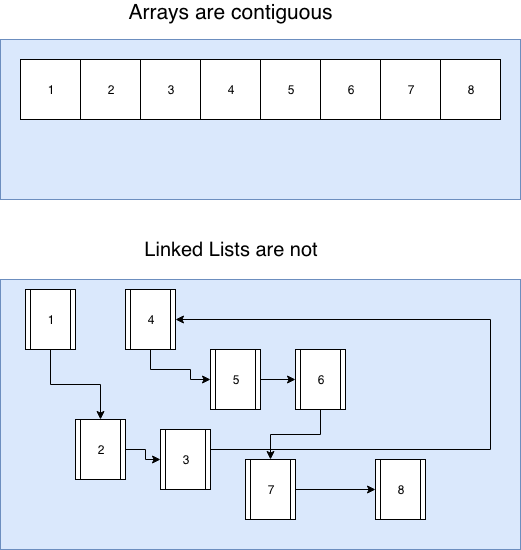

# Implementation Details of Linear Structures

This lesson teaches students about Arrays (as in C arrays) and Linked Lists.

# Learning Objectives

* Students can describe the difference between an Abstract Data Type and an implementation
* Students can describe the difference between an Array and a Linked List
* Students can compare and contrast the speed of operations in Arrays and Linked Lists
* Students can implement and analyze a queue or stack backed by
  * A Linked List
  * An Array

## Abstract Data Type vs Implementation (5 minutes)

* __What is the difference between an abstract data type and an implementation of a data type?__
  * *Crucial that students can see how we can define desired behavior without specifying HOW that behavior is achieved.*
  * *Lean on last class exercise: multiplication is abstract, but your homework had two different implementations of multiplication; one ran in linear time, the other in logarithmic time.*
* __What makes ADT's valuable to us as programmers?__
  * *"Test the interface, not the implementation"*
  * *Makes it possible to compare implementations if they share an ADT*
  * *Helpful during the design process: describe what you want, THEN build something to do that*

## Dynamic Array Sample Implementation (20 minutes)

* __Socratic: At the C (the language) level, what is an array?__
  * *Computer Memory is a series of consecutive bits (not exactly but this is a good mental model)*
  * *An array is some subset of these contiguous bits*
  * *We get a pointer to the start of that memory block*
  * *We know how big each item is*
  * *We know the number of items that we have reserved space for*
* __Everyone Draws: A diagram that represents this concept of an array__
  * __Share: describe your diagram to your neighbor__
  * *Wander the class and listen to the conversations if possible!*
  * *Draw your own diagram and explain it to the students, or ask a student to draw theirs on the board for the whole class and discuss it*
* Real implementations of arrays build on this simple idea, and add some other "known memory locations" for example, to store the length of the array.
* __Socratic: So what happens when we try and insert data after the last index?__
  * *We can throw an error*
  * *Or we can resize*
* Most array implementations these days reserve more memory and copy the values to the new enlarged memory space!
* __Discuss:__
  * __What are some decisions you'd have to make at resize time?__
    * *how much bigger should we make the new space?*
    * *Is there room to expand this array right at the end of this one?*
  * __Will the new memory location start at the same place as the old one?__
    * *We can't ALWAYS do this, but if we do we can avoid copying the old data into a new location*
    * *But honestly this is an unlikely outcome.*
  * __What if there isn't enough memory?__
    * *We can still throw an error! but that's about it.*
  * __How much more memory should we get?__
    * *Conventional wisdom used to be to double the size*
    * *V8's implementation currently makes new space 9/8ths as big as the old space*
    * *Talk about the tradeoffs here, it's a great way to discuss overuse of memory vs less computational cost of resizing more frequently.*

## Linked List Implementation Details (20 minutes)

* A Linked List is a series of nodes connected by pointers.
* Each node is a value and 1 or 2 pointers to other nodes.
* In a singly linked list every node knows which node comes after it.
  * In a doubly linked list every node ASLO knows which node. comes before it.
* Reordering data is a matter of changing the pointers
* Head and Tail are our "entry points" to the data--they are pointers that always point to the first and last elements in the list.
* __Discuss:__
  * __would we ever want to not have a tail or head?__
    * *You always need the head, but you don't NEED the tail. Typically, you'll have both.*
  * __what are some advantages to single vs double linkage?__
    * *Double links takes more memory*
    * *Double links makes some of the functions easier to implement & faster*
      * *addRight is an example of something that is much better with double linked and a tail*
  * __Compare these to arrays in terms of Big O and important operations.__
  * *Make sure to discuss inserting on both ends, in the middle, access by index, and removal*
* __Pair/Share: Array's are "contiguous blocks of memory", how would you describe a linked lists memory usage?__
  * *They're all over the place, each new node gets created on the fly, so who knows how the memory locations are related to each other. All we know is that if we follow the pointers everything will work out.*
* __Everybody draws: Draw a diagram that contrasts these two models__
  
* __What are the pros and cons of this more 'flexible' memory model?__
  * *Constant time add left is an example of an advantage*
  * *Never need to "resize" is an advantage*
  * *More memory per item is a disadvantage*
  * *Fragmented memory could be a disadvantage or advantage depending on your use*
    * *But, due to cache utilization and modern computer architecture, it's probably a disadvantage*
* __Give students a chance to ask questions about this API__

```
class List {
  constructor();
  push();
  pop();
  pushLeft();
  popLeft();
  insert(idx);
  size();
}
```


## Exercise: Comparing Performance (10-15 minutes)

* For each, ask students to (in pairs) define the big O of these operations in both Arrays and Linked Lists:
* Students should also describe the operations in pseudocode and draw a step by step diagram for each operation.
  * push(val)
    * *Array: O(1) (as long as we don't resize. You can introduce the term "Amortized" constant time)*
    * *Linked List: O(1) (always, not amortized)*
  * pushLeft(val)
    * *Array: O(n), we have to shift every item one to the right to make room*
    * *Linked List: O(1), just create a node then adjust the head pointer and the first node's prev/next pointer.*
  * insert(idx, val)
    * *Array: O(n), have to shift items to the right of idx*
    * *Linked List: O(n), have to iterate to find the two nodes where you are performing the insert*
    * *Both are linear, but for different reasons, which is worth pointing out.*

## Some Closing Thoughts

* Memory usage has a significant impact, even though linked lists have some favorable complexity O(1) for many operations, they are not used because of the way computer memory/caching works.
  * This is another example of a place where Big O breaks down a little bit.
* Objects, Arrays, and other data types in JavaScript are *very complex* -- they are combinations of c-arrays, linked lists, hash tables, and more. For example:

```js
let a = [];
a[100000000] = 2;
```

* with the V8 engine, a is now a hash table, not an array, because it would be very wasteful to have (100000000-1) empty slots just to store the value 2 at the end.

## Class Exercises

* [Implement a singly linked list](https://leetcode.com/problems/design-linked-list/description/)
