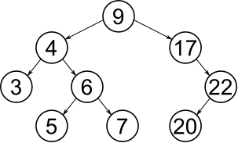

# Intro To Trees

This lesson is about trees.

## Learning Objectives

* Students can define trees
* Students can use important tree terminology
* Students can identify various trees in computer programming
* Students can implement BFS and DFS on trees

## Definitions (10 minutes)

* __What is a tree?__
  * *Define the "single path" restriction*
  * *Describe the "no cycles" property*
* __Give some examples?__
  * *The DOM*
  * *Filesystems*
  * *Org charts, family trees*
  * *"Search trees" such as BST, Trie, and B-Tree or others may come up*
* __What are trees good at?__
  * *Representing hierarchical data.*
* Introduce trees and the important terminology:
  * node, root, leaf, child/children, parent

## Search and Traversal (30 minutes)

* Search "stops" when you find the element.
* Traversal explores the whole tree before stopping.
* Both use essentially the same Algorithms
* Two main kinds: DFS, BFS.
* Go over an example of each using drawings.
* __How can we implement these algorithms?__
  * *Using stacks and queues of course!*
  * Put some pseudocode on the board:

```js
function BFS(rootNode) {
  // Check that a root node exists.
  if (rootNode === undefined) {
    return;
  }

  let queue = [];
  queue.push(rootNode);

  while (queue.length > 0) {  
    let currentNode = queue.shift();
    console.log(currentNode.value);
    for(let child of currentNode.children) {
      queue.push(child);
    }
  }
}
```

* What about DFS?
  * *Just change the stack to a queue!*

```js
function DFS(rootNode) {
  // Check that a root node exists.
  if (rootNode === undefined) {
    return;
  }

  let stack = [];
  queue.push(rootNode);

  while (queue.length > 0) {  
    let currentNode = queue.pop();
    console.log(currentNode.value);
    for(let child of currentNode.children) {
      queue.push(child);
    }
  }
}
```

## Exercise: Simulate BFS/DFS (15 minutes)

* Consider this tree:



* __Simulate the execution of BFS and DFS on this tree__
  * __Maintain the stack and queue explicitly!__
  * __What order will the nodes be explored in?__
    * *There are multiple right answers for both BFS and DFS depending on which order children are inserted into the stack/queue. Assuming child nodes are added left to right into the stack of queue:*
      * *BFS: 9, 4, 17, 3, 6, 22, 5, 7, 20*
      * *DFS: 9, 17, 22, 20, 4, 6, 7, 5, 3*

## Stacks, Recursion, and Trees

* Trees are a recursive data structure, and so they lend themselves to being processed recursively. Check out this recursive implementation of DFS:

```js
function DFS(node, val) {
  if(node.val === val) {
    return node;
  }

  for(let node of node.children) {
    let returnedBelow = DFS(node);

    if(returnedBelow !== undefined) {
      return returnedBelow;
    }
  }
}
```

* *Walk through the same tree, keeping track of the call stack explicitly*


## Exercises

* [Path Sum](https://leetcode.com/problems/path-sum/description/)
* [Path Sum II](https://leetcode.com/problems/path-sum-ii/description/)
* Bonus: [Path Sum III](https://leetcode.com/problems/path-sum-iii/description/)
* Bonus: [Duplicate Subtrees](https://leetcode.com/problems/find-duplicate-subtrees/description/)
