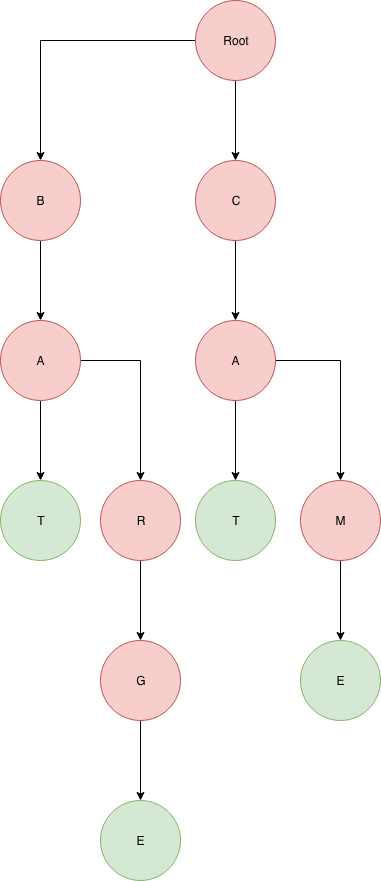

# Special Trees

This lesson is about a couple tree specializations; BSTs and Tries.

## Learning Objectives

* Students can define binary search trees
* Students can implement binary search on a BST
* Students can identify the balance problem that AVL trees and Red-Black trees solve
* Students can define Tries
* Students can implement `valueExists` in a Trie

## Binary search trees (10 minutes)

* __What is a binary search tree?__
  * *Binary: every node has at most 2 children*
  * *Search property: Left always less than node, right always more than node, no duplicates.*
* __What is the purpose of a BST?__
  * *Provide an efficiently search-able hierarchy for representing sorted data.*
  * *Fundamentally, BSTs and Hash Tables solve similar problems: making it easier to find values within a dataset*
  * *Databases use B-Trees and Hash tables extensively as indexing strategies (B-Trees are an extension of the BST concept)*
* __everyone draws__: a valid binary search tree with at least 10 nodes.
  * *Invite one student to draw theirs on the board*
* __Exercise: Write pseudocode for binary search on a BST.__
  * *The recursive version is super easy:*

```js
function binarySearch(node, value) {
  if(node.value === value) {
    return node;
  }

  if(value < node.value && node.left !== undefined) {
    return binarySearch(node.left, value);
  }
  else if(value > node.value && node.right !== undefined) {
    return binarySearch(node.right, value);
  }

  // Otherwise the value is not in the tree, return undefined.
}
```

* __Exercise: Implement an "In order traversal" of a BST to print the values from smallest to largest__:
  * *Once again, recursion is really the easiest way to do this*

```js
function inOrderTraversal(node) {
  if(node.left !== undefined) {
    return inOrderTraversal(node.left);
  }

  console.log(node.value)

  if(node.right !== undefined) {
    return inOrderTraversal(node.right);
  }
}
```

## Problems with BST, and BigO (10 minutes)

* __Instructor draws a sorted linked list__
  * __discuss is this a binary search tree?__
    * *Yes, it totally is!*
  * __whats the big O of searching in this BST?__
    * *Linear time :(*
  * __Does that jive with what we learned about binary search??__
    * *Not really...*
* Being properly "balanced" is crucial to the value of a BST.
* There are two popular kinds of "self balancing" binary search trees called AVL trees and Red Black Trees
* Knowing exactly how they work is not really that important, but they are interesting and cool data structures so feel free to look them up.
* Because those trees are always balanced, they always have the O(log n) search time we're expecting.

## Tries (15 minutes)

* BST's are trees with specially ordered data that make it quick to search for numbers.
* Tries are trees with specially ordered data that make it quick to search for words.
* Each node is a letter, and each edge denotes the next letter in a word.
* *Draw an example with words: cat, came, bat, bar, barge*

  
  * *The paths to green nodes are words. The paths to red nodes don't represent words just intermediate states*
* Notice that Tries are also effiecnt at storing data, because each node can be reused by many words.
  * Give the example of an english language dictionary that is just a list of all the words in order vs the trie version.
    * e.g. every word starting with A gets a unique copy of A in the first version. In the trie all words starting with A share the A node that is a child of the root.
* This is a very popular data structure for auto-complete as well as spell-check algorithms!
* __Exercise: Pseudocode isWord for a Trie__

```js
function isWord(trieNode, word) {
  if(word === '') {
    return true;
  }

  let letter = word[0];
  let nextNode = trieNode.children[letter];
  if(nextNode !== undefined){
    return isWord(nextNode, word.slice(1));
  }

  return false;
}
```

## Exercises

* [Validate a BST](https://leetcode.com/problems/validate-binary-search-tree/description/)
* [Implement a prefix tree AKA a trie](https://leetcode.com/problems/implement-trie-prefix-tree/description/)
