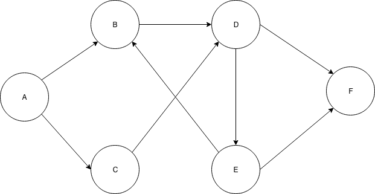

# Intro To Graphs

This lesson is about graphs.

## Learning Objectives

* Students can define graphs and use graph terminology
   * node/vertex, edge, directed/undirected, weighted/unweighted
* Students can simulate BFS and DFS over graphs on whiteboard/paper
* Students can write pseudocode for BFS and DFS on graphs

## Intro to graphs (10-15 min)

* Graphs are an incredible way to model relationships between things.
* Define critical graph terminology:
  * node/vertex -- the basic unit in a graph, the things being modeled.
  * edge -- a connection between two nodes
  * directed/undirected
  * weighted/unweighted
  * And more: nodes can have any kinds properties, edges can be labeled with more than numeric values, a single graph could have many kinds of edges...
  * nearly infinite flexibility exists, but restrictions are still powerful!
* Define a process for modeling a problem using graph theory
  * What are the nodes?
    * Do they need any properties? what properties?
  * What are the edges?
    * Directed/undirected?
    * weighted/unweighted?
    * Do they need any other properties?
  * What feature of the graph would be a solution to this problem? (often a path)

## Practice modeling things with graphs (15-20 minutes)

* __In Pairs, model each of the following as a graph and draw an example?__
  * *Give students 5 minutes for each one, then discuss them as a class.*
  * *Answer the questions from the process above: what are the nodes, what are the edges, directed or not, weighted or not?*
    * *There might be lots of permutations for each of these that is "correct" so entertain multiple answers!*
  * *Facebook*
  * *Twitter*
  * *The Internet as a set of webpages with links*
  * *The Internet as a set of physically connected computers*

## Define BFS and DFS for Graphs.

* The main difference from trees is that we need an explored list.
* __Why do we need to keep track of where we've been in a graph but not a tree?__
  * *In a tree there is exactly one path between any two nodes or those nodes aren't connected*
  * *In a graph, there might be several ways, including cycles. If we don't use an explored list we could search in a cycle forever.*
* Draw a simple graph such as:



* __Exercise: determine which order the nodes will be searched in both BFS and DFS starting at A with a goal of F__
  * *Ties might be broken arbitrarily so there are multiple correct answers*
  * *Assuming ties are broken by first exploring the alphabetically first node:*
  * *BFS: B, C, D, E, F*
  * *DFS: B, D, E, F*
* __What PATH would be returned by BFS and DFS from A to F?__
  * *BFS: A->B->D->F*
  * *DFS: A->B->D->E->F*

## Psuedocode for BFS/DFS graphs

```js
function BFS(startNode, goalNode) {
  let frontier = [];
  let exploredList = new Set();
  frontier.push(startNode);

  while (frontier.length > 0) {  
    let currentNode = frontier.shift();

    // check if it's the goal
    if(currentNode === goalNode) {
      return true; // found the node
    }

    // If we already explored this node, don't add it's children to the frontier
    if(exploredList.contains(currentNode)) {
      continue;
    }

    // Explore the node by adding all it's children
    for(let neighbor of currentNode.neighbors) {
      frontier.push(neighbor);
    }

    // Mark the node explored
    exploredList.add(currentNode);
  }

  // Never found a path to the goal/
  return false;
}
```

* DFS uses the frontier as a stack insead of a queue, the only difference is that we pop instead of shift on the line `currentNode = frontier.shift()`
* __Exercise: repeat the BFS and DFS from above, but this time explicitly keep track of the frontier and the explored list.__
  * *Follow the pseudocode carefully, note how in DFS the cycle B->D->E->D is avoided by the explored list.*
* __Okay, now the tricky part: our current implementation does not return the path, it just returns true or false indicating the existance of a path. How could we change our algorithm to return the path?__
  * *Either, in the explored list keep track of the 'parent' node when we explore each node*
  * *Or maintain a growing list of the path so far for each new node we visit*
  * *Next class we'll revisit and look at code that does this*

## Exercise:

* [Watch this short clip from Die Hard 3](https://www.youtube.com/watch?v=BVtQNK_ZUJg)
  * Model this problem as a graph, and show that DFS or BFS could be used to answer the question:
    * What are the nodes?
    * What are the edges?
    * Weighted/unweighted?
    * Directed/undirected?
    * Draw a graph representing this Jugs problem--at least enough of the graph to show the solution to the riddle as a path in the graph.
    * Highlight a path within the graph that represents a solution to the riddle.
* *Students have to basically invent a "state machine" to do this. At the start of next class, go over the solution.*
* *Nodes are the current state of both jugs, starting node is 0/5 and 0/3*
* *Edges represent actions that can be taken, fill one of the jugs, empty one of the jugs, pour the water from one jug into another.*
* *Edges are directed, not all actions are reversible*
* *Edges are unweighted, taking an action doesn't have a "cost" associated with it.*

## Bonus Problems

Model the following problems as graphs:

* What are the nodes?
* What are the edges?
* Weighted/unweighted?
* Directed/undirected?
* Define a path in the graph that indicates a solution to the problem.

### Word Ladder Problem

A word ladder is a way to connect 2 words. If you can take a word, changing one letter at a time, turn it into another word, and every intermediate step is still a word, those two words have a word ladder. For example, a ladder can be built between cat and dog:

```
cat
cot
dot
dog
```

Three letter words are pretty easy, four letter words are harder.

Can you create an algorithm, using you graph library, that can determine if two words have a ladder; and if so return the series of words that makeup the word ladder, in order.

* *Nodes are words*
* *Edges exist between words that are exactly one letter different from each other.*
* *Edges are undirected, being off by one letter is a mutual relationship.*
* *Edges are unweighted, the relative cost of "choosing" any word is the same as any other word.*
* *The existence of any path between the starting world and the ending word indicates a ladder can be built.*

### Pancake Flipping

You have a stack of pancakes with different widths. They are currently in a strange order, but you'd like to get them ordered from fattest to thinnest in a pancake pyramid.

Unfortunately, you have very limited grill space so the only thing you can do is insert your spatula somewhere in the stack and flip the pancakes on top of your spatula over. Whatever pancake used to be on the top of the stack will now be wherever you inserted your spatula, and the pancake that was directly on top of your spatula is now on the top of the stack. Everything below your spatula remains unchanged.

What is the fewest number of flips you can make in order to get the pancakes in order?

* *This is another state machine*
* *Nodes are the current ordering of the pancakes*
* *Edges represent all of the places you can put the spatula and flip*
* *edges are undirected, any flip can be reversed*
* *edges are unweighted, we care about the number of flips not anything else*
* *WE have to use BFS because the shortest path between the starting state and the sorted state is the answer. There may be several ways to do it and even ties for the fastest way*
